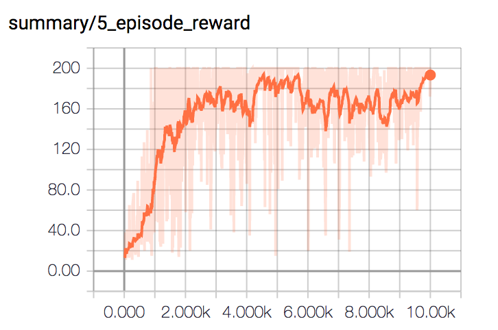

# a2c

implementation of synchronous a2c from Asynchronous Methods for Deep Reinforcement Learning, Google DeepMind, 2016 (arxiv:1602.01783v2)

run main.py to replicate results, edit params.py if you want (200 max score)

10000 training episodes (with weight-sampled actions) on the cartpole problem from OpenAI gym

